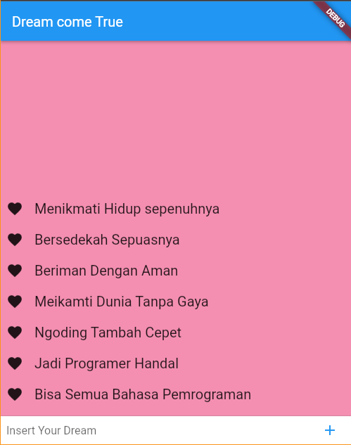

# UAS-Mobile-Programing
 12191696 Koharul Anam
ini adalah sebuah program kecil yang coba saya buat menggunakan Flutter dimana aplikasi ini berfungsi sebagai pencatat mimpi.Memang terlihat tidak terlalu berguna sebenarnya kita bisa menginput kata apapun namun saya perindah sesuai apa yang saya pikirkan.

Disini saya menggunakan Statefulwidget dan stateleswidget dan juga listview sebagai penampil data
#dan inilah sedikit penampakan tentang aplikasi saya.

